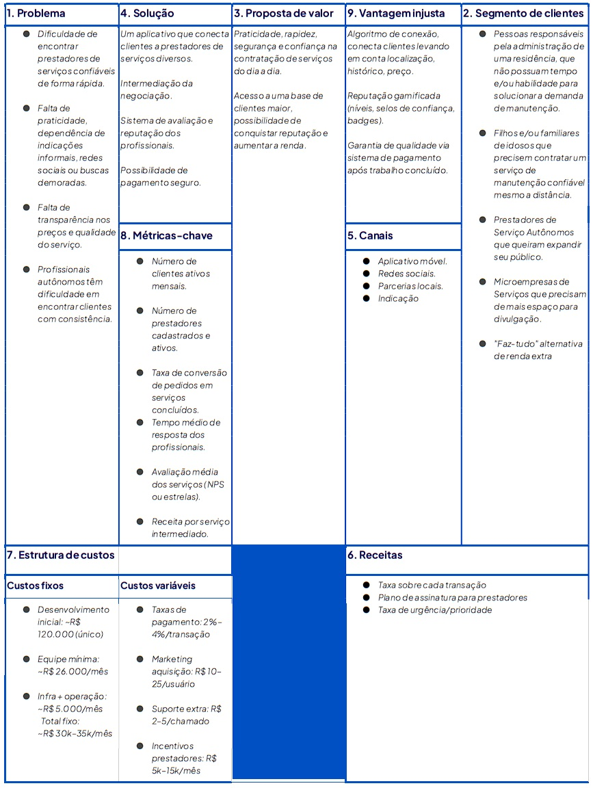

# 📌 Arruma Aqui

Um aplicativo focado em manutenção residencial que fomenta a conexão de pessoas que precisam de reparos ou serviços em casa com empresas e freelancers qualificados. O usuário publica a necessidade de manutenção e junto aos prestadores de serviço negociam sobre a realização do trabalho, facilitando o contato e a contratação.

---

## 👥 Integrantes

- Henrique Rocha – RA: 609413
- Tamoni – RA: 899193

---

## 🧭 Etapas do Projeto

### 1️⃣ Definição do Problema e da Solução
- **Problema identificado:** Atualmente, a contratação de serviços é um processo disperso, que ocorre por meio de indicações, publicações em redes sociais e outros meios. Essa busca pelo profissional ideal pode tornar-se desgastante e, muitas vezes insegura, visto que esses serviços costumam ser realizados sem um contrato que respalde todos os envolvidos, o que pode resultar em transtornos. Além disso, o prestador de serviços precisa de um esforço extra para divulgar seu trabalho, já que seu público-alvo está fragmentado em diversos lugares.
- **Público-alvo:**
  * Público-alvo primário:
    - Pessoas responsáveis pela administração de uma residência, que não possuam tempo e/ou habilidade para solucionar a demanda de manutenção.
    - Filhos e/ou familiares de idosos que precisem contratar um serviço de manutenção confiável mesmo a distância.
       
  * Público-alvo secundário:
    - Prestadores de Serviço Autônomos que queiram expandir seu público.
    - Microempresas de Serviços que precisam de mais espaço para divulgação.
    - "Faz-tudo" alternativa de renda extra      
   
- **Impacto esperado:**
  - A aplicação impacta como um elo condutor entre contratante e contratado, os envolvidos comunicam suas necessidades e acordam sobre a prestação do serviço. Proporcionando comodidade para ambas as partes, a resolução da demanda fica a alguns cliques de distância. 
 
- **Solução proposta:**
  - A aplicação proposta está em todos os pontos de contato de necessidade do público-alvo, desde a divulgação da demanda pelo contratante, passando pela resolução do problema pelo contratado, até o estágio final, o pagamento. Indo além, com um sistema de avaliação e um histórico de serviços prestados/contratados para fortificar a confiabilidade dos usuários. 

### 2️⃣ Lean Canvas / Missão, Visão e Valores
- Lean Canvas
- 
- Missão: Facilitar uma conexão descomplicada e segura entre quem precisa e quem oferece serviços do dia a dia, possibilitando uma negociação justa e transparente. 
- Visão: Construir uma comunidade de milhões de usuários e profissionais, onde a confiança e a oportunidade gerem desenvolvimento econômico para milhares de lares e microempreendedores.  
- Valores: A transparência é o alicerce para uma negociação justa. 

### 3️⃣ Custos e Tributos (Plano de Negócios - PNBOX)
- [Custos e Tributos (Plano de Negócios - PNBOX)](docs/custos_estudo.md)

### 4️⃣ Investimentos e Precificação (../docs/plano_de_negocio.md)
- Investimento inicial:  
- Estratégia de precificação:  
- Justificativa:  

### 5️⃣ SWOT (Análise de Ambientes)
- Forças:  
- Fraquezas:  
- Oportunidades:  
- Ameaças:  

### 6️⃣ Planejamento Estratégico (BSC)
- Objetivos estratégicos:  
- Indicadores e metas:  
- Ações planejadas:  

### 7️⃣ Fluxo de Caixa
- Planilha ou print do fluxo projetado:  
- Principais considerações:  

### 8️⃣ Valuation
- Método utilizado:  
- Valor estimado:  

### 9️⃣ Segurança Cibernética
- Riscos identificados:  
- Medidas de segurança:  

---

## 📅 Diário de Bordo

| Data       | Conteúdo/Etapa                     | Status     | Observações |
|------------|------------------------------------|------------|-------------|
| 06/08/2025 | Apresentação Disciplina + Start    | ✅ Concluído | — |
| 13/08/2025 | Definição dos Grupos e Propostas   | 🚧 Em andamento | Ajustar proposta com feedback do professor |

---

## 📦 Entregas

| Entrega                                | Data       | Descrição                                                         | Status |
|----------------------------------------|------------|-------------------------------------------------------------------|--------|
| Lean Canvas                            | 20/08/2025 | Documento e imagem do canvas                                      | —      |
| Custos e Tributos                      | 27/08/2025 | Planilha com custos fixos, variáveis e tributos                   | —      |
| Análise SWOT / Plano de Negócios       | 24/09/2025 | Análise de ambientes SWOT e entrega do Plano de Negócios          | —      |
| Fluxo de Caixa / Planejamento Estratégico | 15/10/2025 | Planilha de fluxo de caixa e entrega do Planejamento Estratégico  | —      |
| Valuation                              | 05/11/2025 | Relatório com cálculo de valuation                                | —      |
| Valuation      | 12/11/2025 | Valuation | —      |

---

## 🗣️ Feedbacks Recebidos

| Data       | De Quem     | Feedback                                                        | Ação Tomada |
|------------|-------------|----------------------------------------------------------------|-------------|
| 24/09/2025 | Professor X | Melhorar clareza da análise SWOT                                | Revisão feita |

---

## 📚 Lições Aprendidas
- O que a equipe aprendeu durante cada fase.  

---

## 📁 Organização do Repositório

```
📦 projeto/
 ┣ 📂 docs/
 ┃ ┣ lean_canvas.png
 ┃ ┣ custos_tributos.xlsx
 ┃ ┣ swot_plano_negocios.pdf
 ┃ ┣ fluxo_caixa_planejamento.xlsx
 ┃ ┗ valuation.pdf
 ┣ 📂 src/
 ┃ ┣ prototipo/
 ┃ ┗ documentos_planejamento/
 ┣ README.md
```

---
